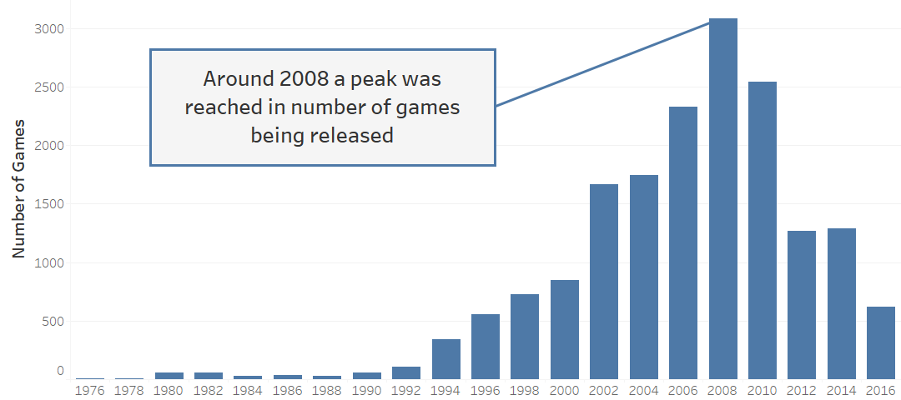
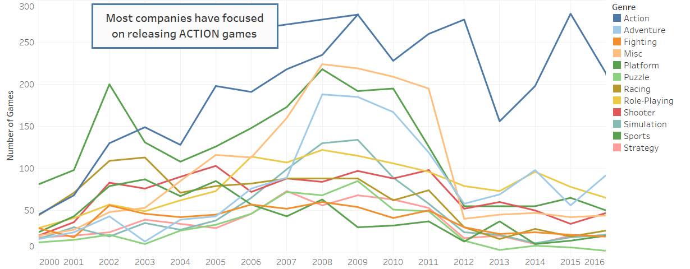
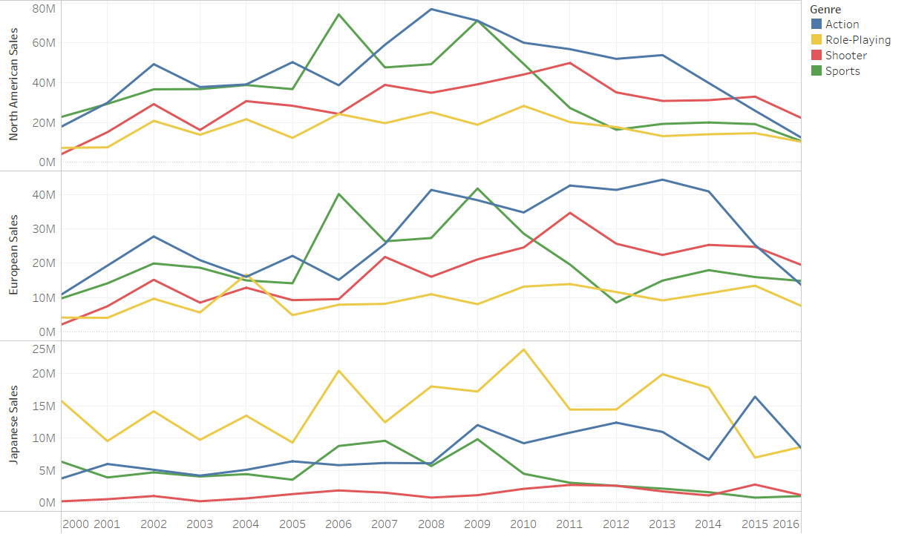
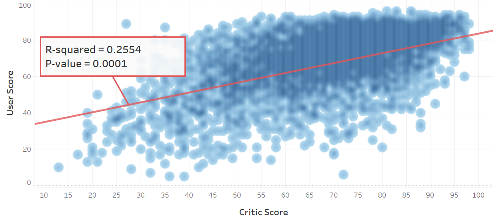

```{r setup, include=FALSE}
knitr::opts_chunk$set(echo = TRUE)
setwd("C:/Users/pc/Documents/Data Analysis Portfolio/Videogame Sales and Rating/Project 1 Video Games R Markdown")
data <- read.csv("Video_Game_Sales_as_of_Jan_2017.csv")
library(dplyr)
```

## Introduction

Video games have been a passion of mine since I was a kid. And though my father bought me a Nintendo for Christmas when I was 8 years old, it wasn't until I was a bit older that I really dove into the gaming space with my very first Playstation game titled "Final Fantasy VII". For many, this game has become somewhat of a classic title, so much so that in 2021 Square-Enix decided to release a remake of the game from the ground up: ["Final Fantasy VII Remake"](https://ffvii-remake-intergrade.square-enix-games.com). Ever since, the gaming industry has experienced tremendous growth across multiple gaming platforms, which I intend to explore in this case study utilizing the data provided by Kaggle under the name [Video Game Sales and Ratings](https://www.kaggle.com/datasets/kendallgillies/video-game-sales-and-ratings) with unknown license.

This study has been broken down into six Sections:

* Section 1: Limitations of this Case Study
* Section 2: Video Game Popularity
* Section 3: Global Gaming Trends by Genre
* Section 4: Critic vs User Scores
* Section 5: Key Takeaways from the Study
* Section 6: Further Studies

## Section 1: Limitations of this Case Study

No case study is perfect and all-encompassing, and it would be foolish to think otherwise. This case study is no exception and, thus, has several limitations which ought to be addressed before moving forward onto the analyses. 

This study was limited in its breath by the information provided within the data set [Video Game Sales and Ratings](https://www.kaggle.com/datasets/kendallgillies/video-game-sales-and-ratings). In it, there were a total of 15 categories, which included title, year or release, developer, platform, genre, sales by market segment, user and critic scores, the number of users and critics that collaborated towards the scores, and the rating.

```{r Data set structure}
str(data)
```

The first limitation found within this data set was the fact that game releases were only considered until January 2017. It became obvious that this data set hadn't been updated, but was still used nevertheless.

The second limitation found within this data set involved the amount of missing information in the columns corresponding to User_Score, User_Count, Critic_Score and Critic_Count. The total number of rows (games) that had missing information were a staggering 10,225 lines, which accounted for more than half of the total data provided in this data set. Therefore, for Section 4 where User_Score and Critic_Score are explored it must be noted that the conclusions drawn may be incomplete.

```{r Missing data}
count(data, complete.cases(data))
```

The third and last limitation of this case study was mobile gaming omission. Nowadays, mobile gaming has been gaining a lot of popularity, which makes it a market segment worth investigating. Unfortunately, the data set had no records pertaining to any mobile games, which will be further discussed in upcoming sections.


## Section 2: Video Game Popularity

Over the years many gaming platforms have come and gone, yet, one could assume that video game popularity hasn't dwindled as a result of this and, instead, has been increasing exponentially. However, after analyzing the data provided by Kaggle, the numbers tell a different story. Below is a bar chart depicting the number of titles released since 1976 until 2016:



This image clearly shows a steady increase in the number of games being released starting around 1988 up until 2008. However, past this point game releases suffered a significant hit which led to less new titles being available on the market. One very plausible reason for this phenomenon is the financial crisis of 2008 that had an impact across all sectors of the economy. Additionally, since many game developers depended on financial support from investors, it stands to reason that the financial priorities of such investors may have changed as a result of the crisis.

Another interesting insight that this graphic conveys is the fact that less games were being released for traditional gaming platforms. However, the data set that was utilized for this study didn't provide any titles for mobile devices (Android and iOS). Thus, it would be interesting to see the gaming trends that these two new markets have set.

## Section 3: Global Gaming Trends by Genre

The field of Economics states that supply and demand should always be taken into consideration for the production of goods and services. As such, one would be inclined to believe that the gaming industry is no stranger to this concept. After all, it makes no sense making games that no one will buy. However, this industry is particularly unique in that it needs to constantly innovate in order to keep gamers coming for more.  



In Figure 2, it is interesting to see how most genres experienced a significant drop around 2012 which, overall, had long-lasting effects ever since in game development choices with ACTION remaining at the top. 

Now, as much as game releases can give a glimpse into global gaming trends, their sales are what deliver a clear picture of what the audience wants and is willing to spend their money on. Thus, a market breakdown of gaming purchases must be made in order to better understand what users are really looking for.



In Figure 3 three markets were analyzed (North American, European and Japanese) as these were the only distinct market segments that were available in the data set. The rest of the markets were all meshed together in one category, which didn't really help distinguish what each market really preferred. It must be noted that only the top 3 choices for each market were selected.

Just by looking at the graphic it is easy to see that the North American and European markets follow similar trends in terms of what users want. However, the Japanese market deviates from this trend significantly as, for the most part, they prefer Role Playing games above all other genres. This is a result that makes a lot of sense to me as I am a big fan of Role Playing games, or RPGs for short, and most of these games come from Japan. Unfortunately, due to a lack of interest in the North American and European markets, many of these games never get translated into English. 

## Section 4: Critic vs User Scores

Similar to the movie industry, the gaming industry has developed its share of critics who try to tell users which games they should buy and which ones they should stay away from. As a gamer, I have oftentimes relied on YouTube reviews before I choose to buy any particular game that picks my curiosity. However, I must admit that many of the games critics deem unworthy of my time turn out to be some of my favorites such as [Mass Effect Andromeda](https://www.ea.com/es-es/games/mass-effect/mass-effect-andromeda). Therefore I don't always trust what they have to say about games.

For this very reason I decided to take a look at the critic and user scores to see if there was any correlation between the two and how this might explain how users make their purchases.



Figure 4 depicts a density plot of the scores given by users and critics to all the available games contained in the data set. At first glance it seems like there might be a somewhat upward correlation after all. However, visual feedback is not enough and, therefore a statistical analysis is needed. 

From the linear regression (depicted by the red line), two values stand out: the R-square and P-values. These two statistics show how reliable the model is and how strong the correlation between the two variables, user and critic scores, really is. And even though the P-value is quite low, which signifies a great significance for the results obtained, the R-squared value is what truly tells the whole story. R-squared values fluctuate from 1 to -1. The closer the value is to zero, the weaker the correlation is. The further away from zero in either direction the R-squared value is, the stronger the correlation. Unfortunately, the correlation in this case was very weak, which meant that critic scores DO NOT explain what user scores will be. As such, this result aligns with my own experiences of not always trusting critics for choosing a game and determining its worth. 

## Section 5: Key Takeaways from the Study

After analyzing game releases, gaming sales and user-vs-critic scores, there are several key takeaways that should be highlighted:

* Following the 2008 financial crisis, many game developers decided to cut back on the number of titles being released each year, which might be explained by a lack of financial funding that came as a result of investors changing their financial priorities.

* Worldwide game developers have predominantly chosen to go for ACTION games above all other genres as they see it as a niche that attracts many gamers.

* The North American and European markets share similar preferences in terms of the genres they go for when purchasing games. In contrast, the Japanese market differs significantly from these two markets, which in turn explains why so many Role Playing games come from that country.

* Critic ratings do not have a direct effect on user decision when it comes to purchasing their games, as their views tend to differ.

## Section 6: Further studies

As stated at the beginning of this study, there were many limitations in terms of the data available for the analysis. Thus, future studies are highly encouraged in order to determine:

* The effect that mobile gaming has had over the gaming industry.
* Gaming trends from 2016 until now for video game platforms. 
* Critic and user scores from 2016 until now.

